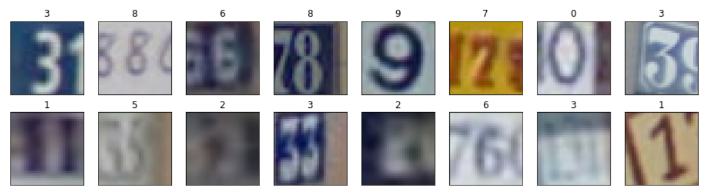

**Goal**

The project is about creating infrastructure for DL projects which I can take as a base and create a new project faster.

The task about recognition houses plate numbers is taken as an example.

**Run**:

`git clone https://github.com/IgorHoholko/DL_ecosystem.git`

 `cd DL_ecosystem/toy_project`
 
 `pip install -r api/requirements.txt`
 
  `sh tasks/evaluate_predictorModel_LeNet.sh`
  
**Additional info**

Experiments link: https://wandb.ai/ihoholko/toy?workspace=user-ihoholko

